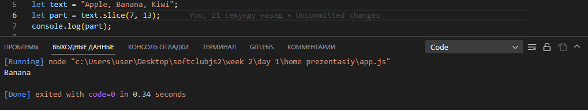

# Table of Contents

# 1 What is a Method in js?

# 2 String

# 3 Number

### Что такое метод в js?

> Метод — это блок кода, который запускается только при вызове.
> Вы можете передавать данные, известные как параметры, в метод.
> Методы используются для выполнения определенных действий, и они
> также известные как функции.

### Создавать js-строки

# СТРОКОВЫЕ МЕТОДЫ JAVA-СЦЕНАРИЯ

#### 1 String length

> 

#### 2 String slice

> slice(start, end)
> JavaScript считает позиции с нуля. Первая позиция 0. Вторая позиция 1.
>  >  > 

#### 3 String substring()

> Разница в том, что начальное и конечное значения меньше 0 обрабатываются как 0 в substring().
> 
> Если вы опустите второй параметр, substring() удалит остальную часть строки.
> 

#### 4 String substr()

> Разница в том, что второй параметр указывает длину извлеченной части.
>  >  > 
