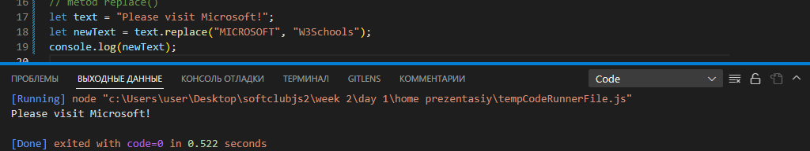

# Table of Contents

# 1 What is a Method in js?

# 2 String

# 3 Number

### Что такое метод в js?

> Метод — это блок кода, который запускается только при вызове.
> Вы можете передавать данные, известные как параметры, в метод.
> Методы используются для выполнения определенных действий, и они
> также известные как функции.

### Создавать js-строки

# СТРОКОВЫЕ МЕТОДЫ JAVA-СЦЕНАРИЯ

#### 1 String length

> 

#### 2 String slice

> slice(start, end)
> JavaScript считает позиции с нуля. Первая позиция 0. Вторая позиция 1.
>  >  > 

#### 3 String substring()

> Разница в том, что начальное и конечное значения меньше 0 обрабатываются как 0 в substring().
> 
> Если вы опустите второй параметр, substring() удалит остальную часть строки.
> 

#### 4 String substr()

> Разница в том, что второй параметр указывает длину извлеченной части.
>  >  > 

#### Replacing String Content Замена строкового содержимого

> Метод replace() заменяет указанное значение другим значением в строке:
> 
> Метод replace() не изменяет строку, для которой он вызывается.Метод replace() возвращает новую строку.
> Метод replace() заменяет только первое совпадение
> По умолчанию метод replace() заменяет только первое совпадение.
> По умолчанию метод replace() чувствителен к регистру. Написание MICROSOFT (с заглавными буквами) не будет работать:
> 

#### JavaScript String ReplaceAll() Заменить все строки JavaScript()

> В 2021 году в JavaScript появился строковый метод replaceAll().
> 

#### JavaScript String toUpperCase() Строка JavaScript toUpperCase()

#### JavaScript String toLowerCase()

#### JavaScript String concat()

#### JavaScript String trim() Обрезка строки JavaScript()

#### JavaScript String charAt()

> Метод charAt() возвращает символ по указанному индексу (позиции) в строке:
> 

#### JavaScript String charCodeAt()

> Метод charCodeAt() возвращает юникод символа по указанному индексу в строке:

Метод возвращает код UTF-16 (целое число от 0 до 65535).

#### JavaScript String split() Разделение строки JavaScript()

> text.split(",") // Split on commas Разделить запятыми
> text.split(" ") // Split on spaces Разделить на пробелы
> text.split("|") // Split on pipe Разделить на трубу
> text.split()
> 

#### indexOf a string for "welcome"

> 

#### includes

#### repeat

#### toString

